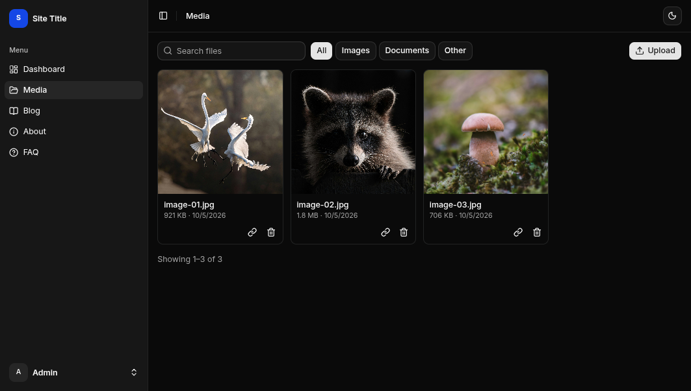
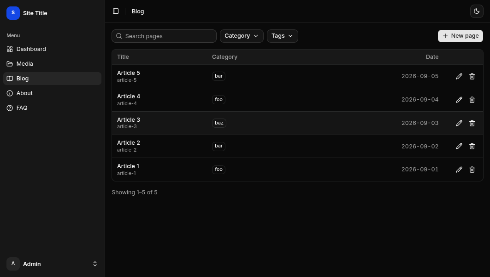
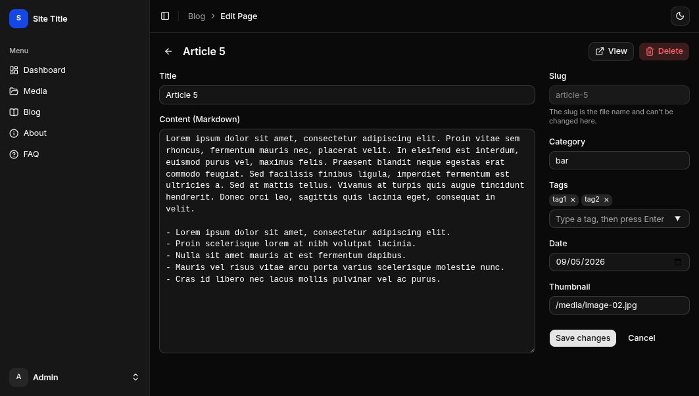
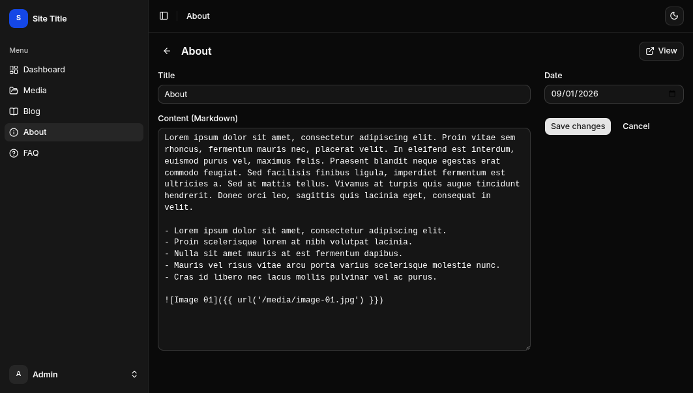

# Simple PHP Site

It's called *Simple PHP Site* because it doesn't impose any structure: no required folder layout, no conventions to learn. It provides only the basics (routing, templating, variables, and functions), which is the minimum needed to build a website. It can be extended freely, from a small site to a larger application backed by SQLite, MySQL, PostgreSQL, or any other solution that fits the project's requirements.

There's not much to document here. Setup is simple: [download or clone it](https://github.com/igoynawamreh/simple-php-site/releases), run the examples, and you'll get the idea. When you're ready, edit the examples or create a new folder in the root directory for your application, then configure the routes, templates, and content sources in `config.php`.

Only the `engine` folder is part of the system; every other folder belongs to the website. Rename them, remove them, or add more folders for applications, pages, or assets. You can organize them however you like. The only requirement is that each folder is defined in `config.php`, where you specify which URLs it handles, which templates it uses, and where its content comes from.

For the exact list of what's available inside a page — variables, functions — check the source directly: `engine/variable.php`, `engine/function.php`, and `engine/route.php`.

Markdown-based content works out of the box, backed by a simple file cache — fine for a few hundred or even a few thousand pages. Planning for tens of thousands? You'll want to swap in something built for that scale, like SQLite, MySQL, or PostgreSQL.

The frontend is just as flexible. Stick with plain HTML-CSS-JS, or bring in a framework like Vue, React, or whatever fits your workflow.

The project also ships with an admin panel, built with Vue (the `panel` folder), for managing content and media files. To add a page to the panel, register a route in `panel/src/router.ts` that points to an existing reusable Vue component or one of your own. You are free to modify anything inside the panel, or build your own panel from scratch. If you don't need the panel, delete the `panel` folder and remove its `/panel` entries in `config.php`.

<table>
  <tr>
    <td></td>
    <td></td>
  </tr>
  <tr>
    <td></td>
    <td></td>
  </tr>
</table>
